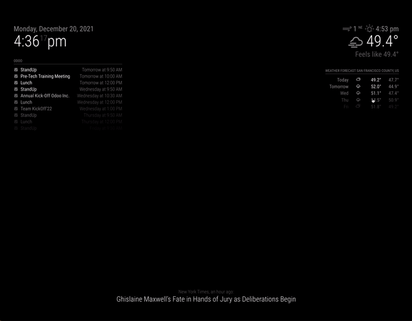

<p style="text-align: center">
	<a href="https://david-dm.org/MichMich/MagicMirror"></a>
	<a href="https://david-dm.org/MichMich/MagicMirror?type=dev"></a>
	<a href="https://bestpractices.coreinfrastructure.org/projects/347"></a>
	<a href="https://codecov.io/gh/MichMich/MagicMirror"></a>
	<a href="https://choosealicense.com/licenses/mit"></a>
	<a href="https://github.com/MichMich/MagicMirror/actions?query=workflow%3A%22Automated+Tests%22"></a>
</p>

# Navigation Button Functionality

A simple and unified way to interact with your MagicMirror. Navigation consists of 2 buttons
that allow the user to cyle through their modules, and 4 context buttons named context1,
context2, context3, and context4 that can change their functionality depending on the currently
active module. If you are using MagicMirror through a browser, mouse support is also available.



## Configuration

```js
buttons: {
  mouseNavigation: true,			// Option to allow using mouse for naviation
  scrollSensitivity: 6,			// Scrolling sensitivity for mouse navigation (Out of 10)
  mappings: {						// Mapping names are based on JS event keycodes
    navigationUp: 'KeyA',		// To select the next module to be active
    navigationDown: 'KeyS',		// To select the previous module to be active
    context1: 'KeyQ',			// 1st context key. Typically used as a scroll up
    context2: 'KeyW',			// 2nd context key. Typically used as a scroll down
    context3: 'KeyE',			// 3rd context key. Typically used as an enter
    context4: 'KeyR',			// 4th context key. Typically used as a go back
  },
  nonInteractiveModules: [ 		// Don't allow certain modules to be active/selected
    'alert',
    'updatenotification'
  ]
},
```

## Supporting Buttons in Modules

Adding support for buttons to modules is very easy. In the module you just need to define
an extra function called `onButtonClick` that acts as a hook. It takes just 1 argument that
would be the name of the button as a string. There are 4 possible names (context1, context2,
context3, context4). Below is a quick example that I created in the newsfeed module to be
able to scroll back and forth between stories, and open them in a new tab.

```js
onButtonClick: function (e) {
  if (e === "context1") {
    this.activeItem = Math.min(this.activeItem + 1, this.newsItems.length - 1);
  } else if (e === "context2") {
    this.activeItem = Math.max(this.activeItem - 1, 0);
  } else if (e === "context3") {
    window.open(this.newsItems[this.activeItem].url, "_blank").focus;
  }
  this.updateDom(100);
},
```

## Features

- Remappable buttons
- Optional Mouse Support
- Mouse Scroll Sensitivity

## Todo

- Add button functionality to all built in modules
- Auto detect modules that have support and whitelist only them
- Add support for long pressing/double tap
